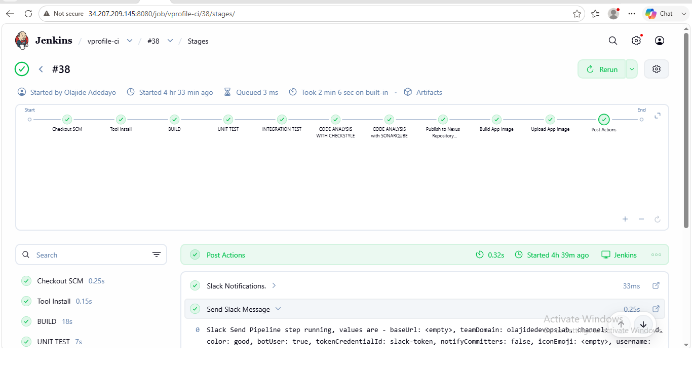
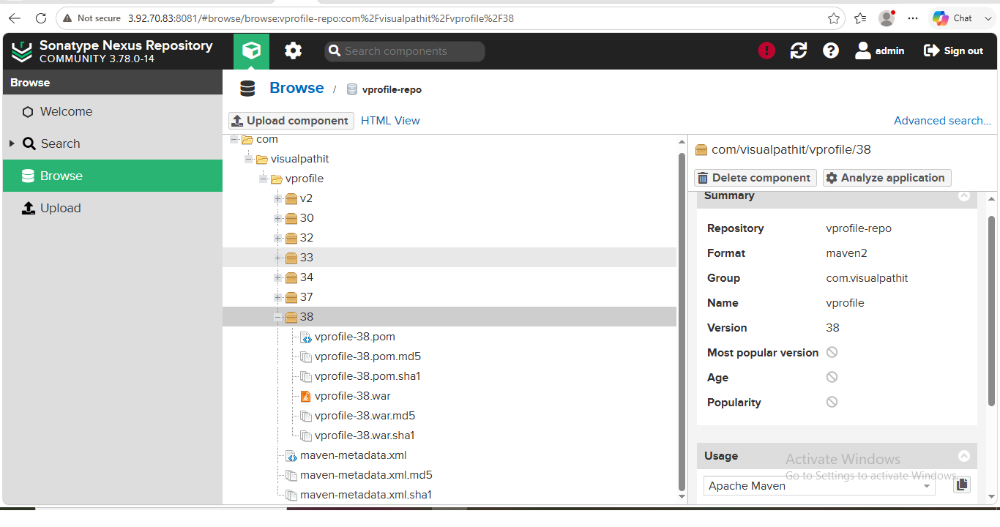
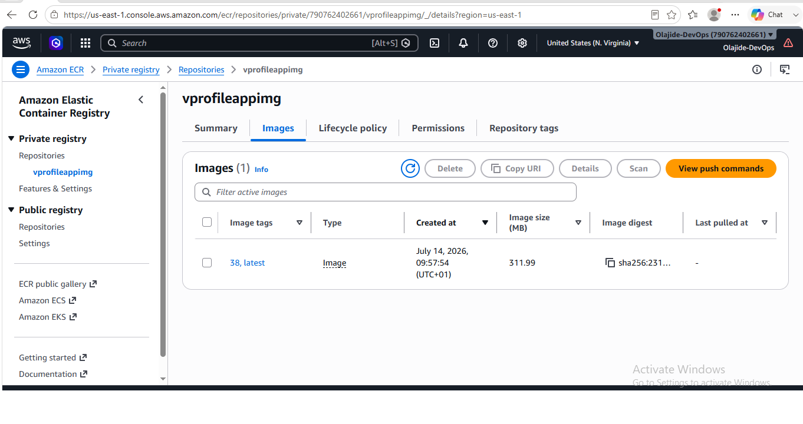
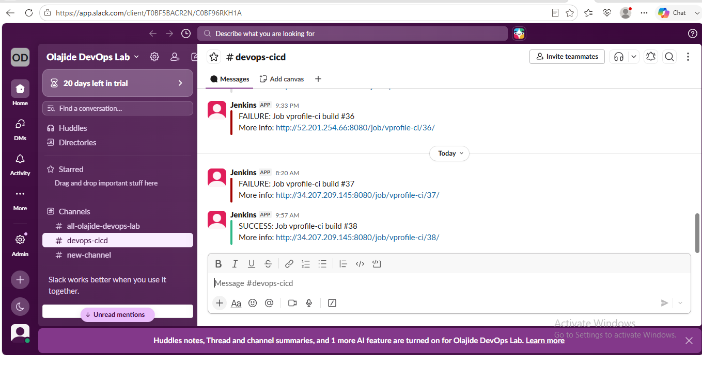
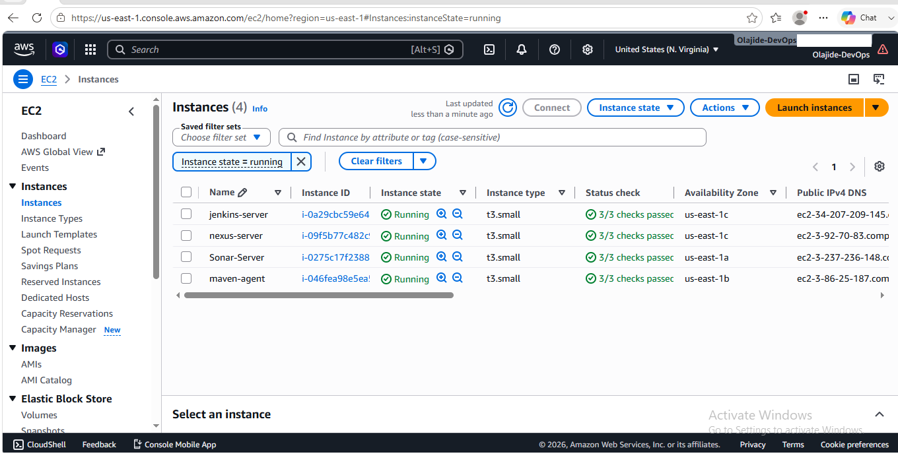
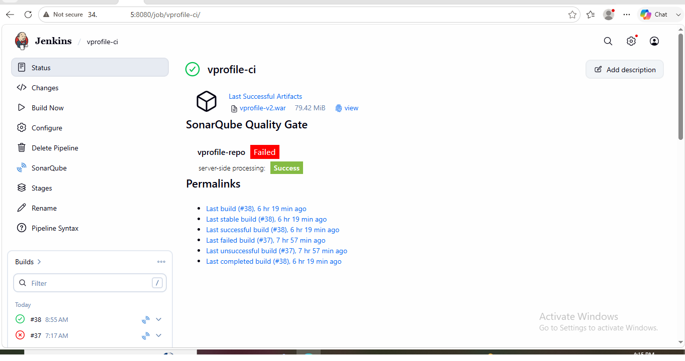

# Containerizing Java Applications with Docker and Publishing Images to Amazon ECR Using Jenkins Pipeline

## Enterprise DevOps Portfolio Project

This project demonstrates how a Java application can be *containerized using Docker* and automatically *published to Amazon Elastic Container Registry (Amazon ECR)* through a *Jenkins Declarative Pipeline*.

The implementation extends an enterprise Continuous Integration (CI) pipeline by integrating Docker image creation, image versioning, Amazon ECR authentication, automated image publishing, and Slack notifications. The completed pipeline validates application quality, packages the application into a Docker image, stores the build artifact in Nexus Repository Manager, publishes the container image to Amazon ECR, and notifies the development team upon pipeline completion.

> *Project Status:* ✅ Completed Successfully

## Table of Contents

- [Project Overview](#project-overview)
- [Business Objective](#business-objective)
- [Solution Architecture](#solution-architecture)
- [Technology Stack](#technology-stack)
- [AWS Infrastructure](#aws-infrastructure)
- [Docker & Amazon ECR Configuration](#docker--amazon-ecr-configuration)
- [Jenkins Pipeline Workflow](#jenkins-pipeline-workflow)
- [Jenkinsfile Implementation](#jenkinsfile-implementation)
- [Docker Image Build & Amazon ECR Push Process](#docker-image-build--amazon-ecr-push-process)
- [Implementation Summary](#implementation-summary)
- [Project Screenshots](#project-screenshots)
- [Repository Structure](#repository-structure)
- [Troubleshooting](#troubleshooting)
- [Lessons Learned](#lessons-learned)
- [Skills Demonstrated](#skills-demonstrated)
- [Future Enhancements](#future-enhancements)
- [Author](#author)

## Project Overview

This project demonstrates the implementation of an enterprise-grade Continuous Integration (CI) pipeline that extends beyond traditional build automation by incorporating Docker containerization and Amazon Elastic Container Registry (Amazon ECR) integration.

The solution automates the complete application packaging workflow using a Jenkins Declarative Pipeline. Every pipeline execution compiles the Java application with Maven, performs automated testing, executes static code quality analysis with Checkstyle and SonarQube, evaluates the configured Quality Gate, publishes the generated WAR artifact to Nexus Repository Manager, builds a Docker image using a multi-stage Dockerfile, and securely pushes the image to a private Amazon ECR repository.

To support image versioning and deployment consistency, each successful pipeline execution tags the Docker image with both the Jenkins build number and the latest tag before publishing it to Amazon ECR. Upon completion, Slack notifications provide immediate feedback on the pipeline execution status.

Throughout the implementation, several real-world integration challenges—including SonarQube connectivity, webhook configuration, changing EC2 public IP addresses, AWS credential validation, and Amazon ECR authentication—were successfully diagnosed and resolved, resulting in a fully functional end-to-end CI pipeline suitable for modern containerized application delivery.

## Business Objective

Modern software delivery requires applications to be packaged consistently, stored securely, and made readily available for deployment across different environments. Manual container image creation and distribution are time-consuming, error-prone, and difficult to scale within enterprise CI/CD workflows.

The objective of this project was to automate the containerization and image publishing process by extending an existing Jenkins-based Continuous Integration (CI) pipeline with Docker and Amazon Elastic Container Registry (Amazon ECR).

The implemented solution enables Jenkins to automatically:

- Build the Java application from source code.
- Validate code quality through automated testing and static analysis.
- Package the application into a Docker image using a multi-stage Dockerfile.
- Version container images using both the Jenkins build number and the latest tag.
- Securely publish Docker images to a private Amazon ECR repository.
- Notify the development team of pipeline execution results through Slack.

By automating these activities, the solution improves build consistency, reduces manual intervention, enhances traceability through image versioning, and prepares container images for future deployment into container orchestration platforms such as Amazon ECS or Kubernetes.

## Solution Architecture

The solution architecture extends an enterprise Continuous Integration (CI) pipeline by incorporating Docker containerization and Amazon Elastic Container Registry (Amazon ECR) for automated container image management.

The pipeline begins when application source code is available in the GitHub repository. Jenkins orchestrates the entire workflow by compiling the application with Maven, executing automated unit tests, performing static code quality analysis with Checkstyle and SonarQube, evaluating the configured Quality Gate, publishing the generated WAR artifact to Nexus Repository Manager, building a Docker image using a multi-stage Dockerfile, authenticating with Amazon ECR, pushing the versioned Docker image to a private Amazon ECR repository, and finally sending build notifications to Slack.

### Architecture Workflow

text
Developer
      │
      ▼
GitHub Repository (docker branch)
      │
      ▼
Jenkins Declarative Pipeline
      │
      ▼
Maven Build
      │
      ▼
Unit Tests
      │
      ▼
Integration Tests
      │
      ▼
Checkstyle Analysis
      │
      ▼
SonarQube Static Code Analysis
      │
      ▼
Quality Gate Evaluation
      │
      ▼
Nexus Repository Manager
      │
      ▼
Docker Multi-stage Image Build
      │
      ▼
Amazon Elastic Container Registry (Amazon ECR)
      │
      ▼
Slack Notification

This architecture demonstrates a modern enterprise CI workflow that automates application validation, artifact management, container image creation, secure image publishing, and team notification, ensuring consistency, traceability, and repeatability throughout the software delivery process.

## Technology Stack

| Category | Technology | Purpose |
|----------|------------|---------|
| Version Control | Git & GitHub | Source code management and version control |
| CI Platform | Jenkins (Declarative Pipeline) | Orchestrates the end-to-end Continuous Integration (CI) workflow |
| Programming Language | Java (JDK 17) | Application development and compilation |
| Build Automation | Apache Maven 3.9.14 | Build automation and dependency management |
| Unit Testing | Maven | Executes automated unit tests during the pipeline |
| Integration Testing | Maven | Executes automated integration tests during the pipeline |
| Static Code Analysis | Checkstyle | Performs source code style and standards validation |
| Code Quality Platform | SonarQube | Performs static code analysis and evaluates the Quality Gate |
| Artifact Repository | Nexus Repository Manager | Stores and manages versioned WAR artifacts |
| Containerization | Docker | Builds application container images using a multi-stage Dockerfile |
| Container Registry | Amazon Elastic Container Registry (Amazon ECR) | Stores and versions Docker container images |
| Cloud Platform | Amazon Web Services (AWS) | Provides the cloud infrastructure hosting the CI environment |
| Compute Services | Amazon EC2 | Hosts Jenkins, Maven Agent, SonarQube, and Nexus Repository Manager servers |
| Identity & Access Management | AWS IAM | Secures authentication and authorization for Amazon ECR access |
| Team Collaboration | Slack | Sends automated pipeline status notifications |
| Operating Systems | Amazon Linux 2023 & Ubuntu Server 26.04 LTS | Operating systems used across the CI infrastructure |

## AWS Infrastructure

The CI environment was deployed on Amazon Web Services (AWS) using a combination of compute, networking, identity, and container registry services. The infrastructure was designed to support automated application builds, code quality analysis, artifact management, Docker image creation, and secure image publishing to Amazon Elastic Container Registry (Amazon ECR).

### AWS Infrastructure Components

| AWS Service | Configuration | Purpose |
|-------------|---------------|---------|
| AWS Region | us-east-1 (N. Virginia) | Primary deployment region for all cloud resources |
| Virtual Private Cloud (VPC) | Default VPC | Provides network isolation and connectivity for all EC2 instances |
| Amazon EC2 | 4 × t3.small instances | Hosts Jenkins, Maven Agent, SonarQube, and Nexus Repository Manager |
| Amazon ECR | vprofileappimg | Private container registry for storing Docker images |
| AWS IAM | IAM User with programmatic access | Provides secure authentication for Jenkins to push Docker images to Amazon ECR |
| Security Groups | Dedicated security group for each server | Controls inbound and outbound network access for Jenkins, Maven Agent, SonarQube, and Nexus Repository Manager |

### EC2 Infrastructure

| Server | Instance Type | Operating System | Primary Role |
|--------|---------------|------------------|--------------|
| Jenkins Server | t3.small | Amazon Linux 2023 | CI pipeline orchestration and automation |
| Maven Agent | t3.small | Amazon Linux 2023 | Distributed build execution |
| SonarQube Server | t3.small | Ubuntu Server 26.04 LTS | Static code analysis and Quality Gate evaluation |
| Nexus Repository Manager | t3.small | Amazon Linux 2023 | Artifact repository for versioned WAR packages |

The infrastructure supports an automated enterprise CI workflow in which Jenkins coordinates the build process across dedicated services for testing, code quality analysis, artifact storage, container image creation, and image publication to Amazon ECR.

## Docker & Amazon ECR Configuration

Docker was integrated into the Jenkins Declarative Pipeline to automate application containerization after the successful completion of the build, testing, code quality analysis, and artifact publication stages.

A *multi-stage Docker build* was implemented to package the Java application into a production-ready container image. The Docker build process uses the build context located at:

text
./Docker-files/app/multistage/

This approach enables Jenkins to build the application image using the project's multi-stage Dockerfile while maintaining a clean and repeatable container build process.

### Docker Image Versioning

To improve traceability and image management, the pipeline applies two tags to every successful Docker image:

| Image Tag | Purpose |
|-----------|---------|
| ${env.BUILD_NUMBER} | Provides a unique, versioned image corresponding to the Jenkins build number. |
| latest | Identifies the most recent successful Docker image. |

The Docker image is built once and then published to Amazon Elastic Container Registry (Amazon ECR) with both tags, allowing consumers to reference either a specific build or the latest available image.

### Amazon ECR Integration

The pipeline authenticates with Amazon Elastic Container Registry (Amazon ECR) using AWS credentials configured in Jenkins. After successful authentication, the Docker image is pushed to the private Amazon ECR repository:

text
vprofileappimg

The image publishing process is performed within the Jenkins pipeline using Docker registry authentication, ensuring that only authenticated pipeline executions can publish container images to the private registry.

This automated integration eliminates manual image publishing, maintains consistent image versioning, and prepares container images for future deployment workflows.

## Jenkins Pipeline Workflow

The project uses a *Jenkins Declarative Pipeline* to automate the complete Continuous Integration (CI) workflow. The pipeline executes each stage sequentially, ensuring that application quality is validated before artifacts and container images are published.

### Pipeline Execution Flow

| Stage | Description |
|--------|-------------|
| *BUILD* | Compiles the Java application and resolves project dependencies using Apache Maven. |
| *UNIT TEST* | Executes automated unit tests to validate application functionality. |
| *INTEGRATION TEST* | Runs integration tests to verify interactions between application components. |
| *CODE ANALYSIS WITH CHECKSTYLE* | Performs static code style analysis to ensure compliance with coding standards. |
| *CODE ANALYSIS WITH SONARQUBE* | Executes SonarQube static code analysis and submits the results for Quality Gate evaluation. |
| *Publish to Nexus Repository Manager* | Publishes the generated WAR artifact to Nexus Repository Manager for centralized artifact storage and version management. |
| *Build App Image* | Builds a Docker image using the project's multi-stage Dockerfile. |
| *Upload App Image* | Authenticates with Amazon Elastic Container Registry (Amazon ECR) and pushes the Docker image using both the Jenkins build number and the latest tag. |

### Pipeline Characteristics

The pipeline implements a structured CI workflow that:

- Automates application build, testing, and validation.
- Performs multiple code quality verification stages before artifact publication.
- Stores versioned build artifacts in Nexus Repository Manager.
- Builds production-ready Docker images using a multi-stage Dockerfile.
- Publishes versioned container images to a private Amazon ECR repository.
- Sends Slack notifications to communicate pipeline execution status.

This sequential workflow helps ensure that only successfully validated application builds are packaged into Docker images and published to Amazon ECR.

## Jenkinsfile Implementation

The CI workflow is implemented using a *Jenkins Declarative Pipeline*, with the entire pipeline defined as code in a version-controlled Jenkinsfile. This approach enables repeatable, maintainable, and auditable CI automation while allowing pipeline changes to be tracked through Git.

### Jenkinsfile Structure

The pipeline is organized into the following logical sections:

| Jenkinsfile Component | Purpose |
|-----------------------|---------|
| Global Variables | Defines reusable configuration, including Slack notification color mappings for different build outcomes. |
| pipeline | Declares the Jenkins Declarative Pipeline. |
| agent | Specifies the Jenkins execution node responsible for running the pipeline. |
| tools | Configures JDK 17 and Apache Maven 3.9.14 required for the build process. |
| environment | Stores reusable environment variables and credentials required throughout the pipeline, including Docker registry configuration and Amazon ECR authentication. |
| stages | Defines the sequential CI workflow, from application build through Docker image publication. |
| post | Executes post-build actions, including automated Slack notifications to report pipeline status. |

### Pipeline as Code

Managing the CI workflow as code provides several advantages:

- Version-controlled pipeline configuration.
- Consistent pipeline execution across builds.
- Simplified maintenance and future enhancements.
- Improved collaboration through Git-based change tracking.
- Reproducible CI automation using a single Jenkinsfile.

This implementation follows the Pipeline as Code approach by keeping the complete CI workflow under source control alongside the application code, improving reliability, traceability, and maintainability.

## Docker Image Build & Amazon ECR Push Process

Following successful application validation and artifact publication, the Jenkins pipeline automatically containerizes the application and publishes the resulting Docker image to Amazon Elastic Container Registry (Amazon ECR).

### Image Build Process

The Docker image is built using a *multi-stage Dockerfile* with the following build context:

text
./Docker-files/app/multistage/

This stage packages the Java web application into a production-ready Docker image while leveraging Docker's multi-stage build capabilities to streamline the image creation process.

### Image Versioning Strategy

To improve image traceability and version management, each successful pipeline execution applies two Docker image tags:

| Image Tag | Purpose |
|-----------|---------|
| ${env.BUILD_NUMBER} | Creates a unique version of the image for each Jenkins build. |
| latest | Identifies the most recent successful build. |

This tagging strategy enables both version-specific deployments and convenient access to the latest container image.

### Amazon ECR Push Workflow

After the Docker image is successfully built, Jenkins authenticates with Amazon Elastic Container Registry (Amazon ECR) using AWS credentials securely configured in Jenkins.

The pipeline then:

1. Authenticates with the private Amazon ECR registry.
2. Pushes the Docker image tagged with the Jenkins build number.
3. Pushes the same image with the latest tag.
4. Stores both image versions in the private Amazon ECR repository *vprofileappimg*.

The successful completion of this process provides a centrally managed, versioned container image repository that can be consumed by future deployment platforms such as Amazon ECS or Kubernetes.

### Outcome

The implementation automates the complete container image publishing workflow, eliminating manual Docker image creation and registry uploads while ensuring that validated application builds are consistently versioned and securely stored in Amazon ECR.

## Implementation Summary

This project successfully extended an enterprise Jenkins-based Continuous Integration (CI) pipeline by integrating Docker containerization and Amazon Elastic Container Registry (Amazon ECR) for automated container image management.

The implementation achieved the following objectives:

- Configured a Jenkins Declarative Pipeline using Pipeline as Code.
- Built the Java application with Apache Maven 3.9.14 and JDK 17.
- Executed automated unit and integration tests.
- Performed static code analysis using Checkstyle and SonarQube.
- Enforced Quality Gate validation before continuing the pipeline.
- Published versioned WAR artifacts to Nexus Repository Manager.
- Built a production-ready Docker image using a multi-stage Dockerfile.
- Authenticated securely with Amazon ECR using AWS IAM credentials configured in Jenkins.
- Published Docker images to a private Amazon ECR repository using both the Jenkins build number and the latest tag.
- Sent automated Slack notifications to report pipeline execution results.

During implementation, several real-world integration issues—including SonarQube webhook configuration, changing EC2 public IP addresses, AWS credential validation, and Amazon ECR authentication—were successfully diagnosed and resolved, resulting in a fully operational end-to-end CI pipeline.

The completed solution demonstrates modern DevOps practices by combining automated application validation, artifact management, containerization, secure image publishing, and team notifications into a single, repeatable Continuous Integration workflow.

Project Screenshots

The following screenshots provide visual evidence of the successful implementation and execution of the CI pipeline, Docker containerization workflow, Amazon ECR image publishing process, and supporting AWS infrastructure.

### Figure 1 – Jenkins Pipeline Overview

> Successful execution of the complete Jenkins Declarative Pipeline, showing all pipeline stages completed successfully from source code checkout through Docker image publication and post-build actions.
>
> ### Figure 2 – Nexus Repository Manager

> Published Maven application artifact (vprofile-38.war) in Nexus Repository Manager, demonstrating successful artifact versioning and repository management.
>
> ### Figure 3 – Amazon Elastic Container Registry (ECR)

> Docker image successfully published to Amazon Elastic Container Registry (Amazon ECR) with both the build-specific (38) and latest image tags.

### Figure 4 – Slack Build Notification

> Automated Slack notification confirming the successful completion of the Jenkins CI pipeline for build #38.

### Figure 5 – AWS Infrastructure

> Amazon EC2 instances hosting the Jenkins server, Maven build agent, SonarQube server, and Nexus Repository Manager used throughout the CI pipeline implementation.

### Figure 6 – Jenkins Job Dashboard

> Jenkins project dashboard summarizing build history, generated artifacts, and the operational status of the vprofile-ci pipeline.

Repository Structure

.
├── screenshots/
│   ├── 01-jenkins-docker-ecr-pipeline-success.png
│   ├── 02-nexus-vprofile-war-artifact.png
│   ├── 03-ecr-vprofile-docker-image.png
│   ├── 04-slack-jenkins-success-notification.png
│   ├── 05-aws-infrastructure-running.png
│   └── 06-jenkins-job-dashboard.png
├── .gitignore
├── LICENSE
└── README.md

Repository Contents

- README.md – Comprehensive project documentation covering the architecture, implementation, workflow, screenshots, troubleshooting, lessons learned, and technical skills demonstrated.
- screenshots/ – Contains screenshots captured during the project implementation and used throughout the README as supporting technical evidence.
- .gitignore – Specifies files and directories excluded from Git version control.
- LICENSE – Defines the licensing terms for this repository.

Troubleshooting

During the implementation of this project, several configuration and integration challenges were encountered and successfully resolved.

Issue| Resolution
Jenkins pipeline failed during initial executions| Reviewed the pipeline stage logs, corrected configuration issues, and re-executed the pipeline until all stages completed successfully.
SonarQube Quality Gate reported a failed status| Verified that SonarQube analysis completed successfully. The Quality Gate reflected existing code quality findings in the application rather than a pipeline integration failure.
Amazon ECR authentication failed| Verified AWS credentials configured in Jenkins and confirmed successful authentication before pushing Docker images to Amazon ECR.
Docker image push to Amazon ECR| Confirmed the correct Amazon ECR repository configuration and successfully published the Docker image using both the build number and "latest" tags.
Slack notifications were not received during earlier builds| Reviewed the Jenkins Slack integration, corrected the configuration, and confirmed successful notifications after the final pipeline execution.
Changing EC2 public IP addresses after instance restarts| Updated service configurations to use the current public IP addresses, restoring connectivity between Jenkins and dependent services.

Each issue provided practical experience in diagnosing CI pipeline failures, validating integrations, and maintaining a reliable DevOps workflow across multiple tools and AWS services.

Lessons Learned

This project provided hands-on experience in designing, implementing, and troubleshooting a modern CI pipeline that integrates multiple DevOps tools and AWS services. Key lessons learned include:

- Building and maintaining Jenkins Declarative Pipelines using Pipeline as Code.
- Integrating Maven to automate Java application builds and dependency management.
- Executing automated unit and integration tests as part of the CI workflow.
- Performing static code analysis using SonarQube to identify code quality issues early in the development lifecycle.
- Publishing versioned application artifacts to Nexus Repository Manager for centralized artifact management.
- Building Docker images using a multi-stage Dockerfile to create efficient container images.
- Authenticating Jenkins with Amazon Elastic Container Registry (Amazon ECR) and publishing versioned Docker images.
- Automating build notifications through Slack to improve team visibility and collaboration.
- Diagnosing and resolving CI pipeline failures by analyzing build logs, service configurations, and integration points.
- Understanding how multiple DevOps tools work together to deliver a reliable, automated Continuous Integration workflow.

Skills Demonstrated

Throughout this project, the following technical and professional skills were demonstrated:

DevOps & CI/CD

- Jenkins Declarative Pipelines
- Continuous Integration (CI)
- Pipeline as Code
- Distributed Build Architecture
- Build Automation

Programming & Build Tools

- Java
- Maven
- Docker
- Docker Multi-stage Builds

Code Quality & Artifact Management

- SonarQube
- Nexus Repository Manager

Cloud & Infrastructure

- Amazon Web Services (AWS)
- Amazon EC2
- Amazon Elastic Container Registry (Amazon ECR)
- IAM
- Default VPC
- Security Groups

Collaboration & Automation

- Slack Integration
- Git
- GitHub
- Technical Documentation
- Troubleshooting and Root Cause Analysis

Future Enhancements

The following enhancements could further improve this CI pipeline and align it with production-ready DevOps practices:

- Extend the pipeline to support Continuous Deployment (CD) to staging and production environments.
- Integrate automated vulnerability scanning for Docker images before publishing them to Amazon Elastic Container Registry (Amazon ECR).
- Implement Infrastructure as Code (IaC) using Terraform or AWS CloudFormation to provision AWS resources automatically.
- Introduce branch-based pipeline execution for feature, development, and production workflows.
- Integrate automated approval gates before deployment to production environments.
- Enhance monitoring and observability by integrating Amazon CloudWatch and centralized log management solutions.
- Configure automated image lifecycle policies in Amazon ECR to manage older image versions efficiently.
- Expand automated testing by incorporating additional security and performance testing into the CI pipeline.

Author

Olajide Adedayo

AWS Cloud & DevOps Engineer with hands-on experience designing and implementing CI pipelines using Jenkins, Docker, SonarQube, Nexus Repository Manager, Amazon Elastic Container Registry (Amazon ECR), and AWS.

- GitHub: https://github.com/olajide-adedayo
- LinkedIn: https://www.linkedin.com/in/olajide-adedayo-9126593b3/
- Medium: https://medium.com/@olajideadedayo230
